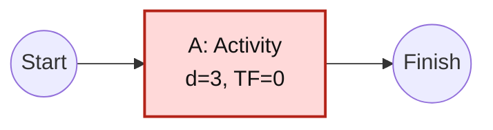

# Critical Path Analysis and Mapping

Use the Critical Path Method to identify the longest dependent route to a selected endpoint and the activities that govern the earliest possible completion date. This workflow is based on the concepts summarized in [Critical path method](https://en.wikipedia.org/wiki/Critical_path_method); treat the supplied schedule data and estimates, not the article, as the project evidence.

## Required Inputs

Obtain:

- Stable activity ID and concise name.
- Duration and one consistent time unit; milestones have zero duration.
- Predecessors and relationship type, including lag or lead when applicable.
- Selected start and logical endpoint or deliverable.
- Calendars, date constraints, status date, actual starts/finishes, and remaining durations when scheduling calendar dates or updating an active plan.
- Resource limits and uncertainty when they are in scope.

If durations or dependencies are missing, return a draft network and the unresolved inputs. Do not invent estimates, dates, logic, progress, or resource availability.

## Procedure

1. Define the analysis boundary, selected endpoint, data date, duration convention, calendar, and whether the result is a baseline, current forecast, scenario, or as-built analysis. Keep these cases separate.
2. Normalize the activity list. Give each activity one stable ID, one duration, explicit predecessor logic, and a deliverable or milestone connection. Add synthetic zero-duration start or finish nodes only when needed to join multiple starts or endpoints, and label them synthetic.
3. Build an activity-on-node directed graph. Validate that every referenced node exists, no activity depends on itself, the graph is acyclic, and all in-scope activities connect to the selected endpoint. Report cycles, dangling nodes, open ends, impossible constraints, and ambiguous dependencies before calculating.
4. Choose the duration model. Deterministic CPM uses the supplied duration $d_i$. When optimistic $o_i$, most likely $m_i$, and pessimistic $p_i$ estimates are supplied and ordered $o_i \le m_i \le p_i$, optionally use the PERT approximation:

   $$E[d_i] = \frac{o_i + 4m_i + p_i}{6}$$

   $$Var(d_i) = \left(\frac{p_i-o_i}{6}\right)^2$$

   Record both the source estimates and derived expected duration. Do not silently mix deterministic and expected durations. PERT's beta-distribution, independence, and path-stability assumptions are approximations; correlated activities and competing paths need scenario or simulation analysis for consequential commitments.
5. Perform the forward pass in topological order. Let $ES_i$ be activity $i$'s earliest start, $EF_i=ES_i+d_i$, and $l$ be lag, with a negative lag representing lead. Each predecessor relationship gives a lower bound on $ES_i$:

   | Relationship $p \rightarrow i$ | Forward lower bound for $ES_i$ |
   | --- | --- |
   | Finish-to-start (FS) | $EF_p + l$ |
   | Start-to-start (SS) | $ES_p + l$ |
   | Finish-to-finish (FF) | $EF_p + l - d_i$ |
   | Start-to-finish (SF) | $ES_p + l - d_i$ |

   Set $ES_i$ to the maximum applicable bound, and prevent it from preceding the modeled project start unless the declared scheduling convention permits that. Start nodes use $ES=0$.

   For a basic finish-to-start network with no lag, this reduces to:

   $$ES_i = \max_{p \in Pred(i)} EF_p$$

   $$EF_i = ES_i + d_i$$

   The selected endpoint's earliest finish is the minimum logic-constrained modeled duration.
6. Perform the backward pass from the selected endpoint in reverse topological order. Set its latest finish to the endpoint's earliest finish unless an authorized target date or constraint applies. Let $s$ be a successor of activity $i$. Each outgoing relationship gives an upper bound on $LS_i$:

   | Relationship $i \rightarrow s$ | Backward upper bound for $LS_i$ |
   | --- | --- |
   | Finish-to-start (FS) | $LS_s - l - d_i$ |
   | Start-to-start (SS) | $LS_s - l$ |
   | Finish-to-finish (FF) | $LF_s - l - d_i$ |
   | Start-to-finish (SF) | $LF_s - l$ |

   Set $LS_i$ to the minimum applicable bound and $LF_i=LS_i+d_i$. For a basic finish-to-start network with no lag, this reduces to:

   $$LF_i = \min_{s \in Succ(i)} LS_s$$

   $$LS_i = LF_i - d_i$$

7. Calculate total float:

   $$TF_i = LS_i - ES_i = LF_i - EF_i$$

   Calculate relationship free float as the unused amount in each outgoing precedence constraint:

   | Relationship $i \rightarrow s$ | Relationship free float |
   | --- | --- |
   | Finish-to-start (FS) | $ES_s - EF_i - l$ |
   | Start-to-start (SS) | $ES_s - ES_i - l$ |
   | Finish-to-finish (FF) | $EF_s - EF_i - l$ |
   | Start-to-finish (SF) | $EF_s - ES_i - l$ |

   An activity's $FF_i$ is the minimum relationship free float across its successors. Define terminal-node free float against the selected endpoint convention. Negative total float indicates a target or constraint conflict, not extra capacity.
8. Apply working calendars and date constraints using their declared time-arithmetic rules. Recalculate all bounds rather than treating nonworking time as ordinary duration. If no calendar-capable calculation is available, return the logic network and numeric-duration result with an explicit warning that calendar dates are unverified.
9. Enumerate the longest path or paths to the selected endpoint. In an unconstrained basic network, longest-path activities normally have zero total float. With date constraints, calendars, or resource effects, report longest-path membership and zero/negative-float status separately; do not assume they are identical.
10. Identify near-critical paths using a supplied threshold. If none is supplied, report path durations and floats without inventing a threshold. Highlight merge points, scarce-resource dependencies, and activities whose delay can create a new critical path. For PERT analysis, report expected path duration and, only under the stated independence approximation, path variance as the sum of activity variances.
11. When requested, estimate critical-path drag: the reduction in endpoint duration possible if a critical activity or constraining wait were eliminated, bounded by parallel-path behavior. Label approximations and recompute the network for material decisions.
12. Evaluate acceleration scenarios separately:
    - **Fast tracking:** overlap activities only when dependency logic permits it; expose rework, coordination, quality, and security risk.
    - **Crashing:** shorten activity duration with added resources or cost only from evidenced crash-duration and cost assumptions; do not assume a linear cost-duration relationship.
    - **Pruning or redesign:** remove or change work only with scope and acceptance authority.
13. Apply resource leveling when resource capacity must be feasible, recognizing that it can change the longest or resource-critical path. Apply resource smoothing only within available float when the endpoint must remain unchanged. Do not present unconstrained CPM dates as a resource-feasible commitment.
14. Recalculate when actual progress, remaining duration, logic, calendars, constraints, or resources change. Preserve baseline versus current forecast, explain variance, and optionally produce an as-built critical path from observed history without rewriting the original baseline.

## Mapping Format

Return both a calculation table and an activity-on-node Mermaid map.

The table must include activity ID, duration model and inputs, predecessors and relationship/lag, $ES$, $EF$, $LS$, $LF$, total float, free float, longest-path status, constraint/resource notes, and evidence or estimate source.

Use a left-to-right map such as:

Use sanitized unique node IDs, keep the original activity ID in the label, show relationship and lag on edges when not ordinary finish-to-start, and visually distinguish critical, near-critical, milestone, completed, and blocked nodes only when those states are evidenced. Accompany styling with text or symbols so meaning does not depend on color alone.

## Output Contract

Return:

- Analysis type, endpoint, status date, units, calendar, constraints, assumptions, and evidence gaps.
- Validated activity/dependency inventory and any graph defects.
- Calculation table and Mermaid network map.
- Earliest endpoint completion, all longest/critical paths, path durations, total/free float, near-critical paths, and negative-float conflicts.
- Resource-feasibility caveat or leveled result, as applicable.
- Optional drag, fast-track, crash, and sensitivity scenarios with cost/risk assumptions.
- Baseline-to-forecast variance and newly critical work for schedule updates.
- Recommended next evidence or authorized decision.

## Quality Gate

- Every activity and dependency in the map appears in the calculation model exactly once.
- The graph is acyclic and connected to the selected endpoint, or defects are explicitly reported and calculations withheld where invalid.
- Forward/backward passes and float values reconcile with the declared conventions.
- FS, SS, FF, and SF relationships and leads/lags use the declared generalized bounds; calendar-date claims use verified calendar arithmetic.
- Every reported critical path has the stated total duration and valid dependency continuity.
- Longest-path, zero-float, constraint-critical, and resource-critical claims are distinguished.
- Estimates, scenarios, and actual observations are not conflated.
- CPM informs sequencing and schedule risk; it does not authorize scope, priority, staffing, iteration start, deployment, or release.