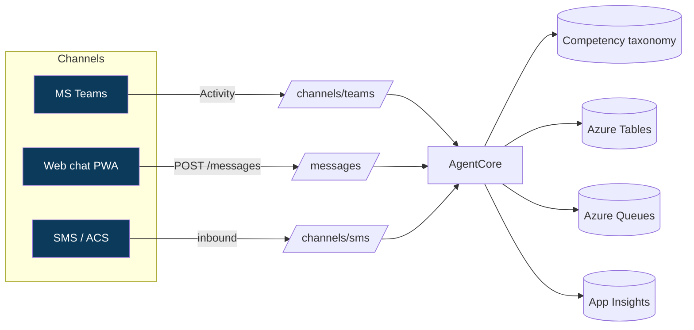

# ci-csa-agent — Architecture (audit-proof design doc)

## Context
Expert (L400) Microsoft solutions architect agent with LSS Black Belt CI discipline. Same app
shape as the rest of the suite (Functions API + SWA PWA + Tables/Queues) so Deming's standards apply.

## Components
| Component | Tech | Responsibility |
| --- | --- | --- |
| `api` | Azure Functions Flex Consumption, Node 20 TS | Brain + channel webhooks |
| `web` | Vite + React PWA on Static Web Apps | Web chat |
| Storage | Azure Tables + Queues | Conversations, events |
| Monitoring | App Insights + Log Analytics | Telemetry |

## Quality attributes (contract §7)
- Core logic isolated in `src/core`; 80% coverage threshold enforced.
- Build budget <180s; PWA offline mode via NetworkFirst API caching.

## Security
- HTTPS only; managed identity for storage; channel webhooks use `function` auth.

## Ring topology (contract §3)
`canary → private → public → ga`, RG `rg-csa-<ring>`, GA on RA-GRS + geo-redundant pair.
