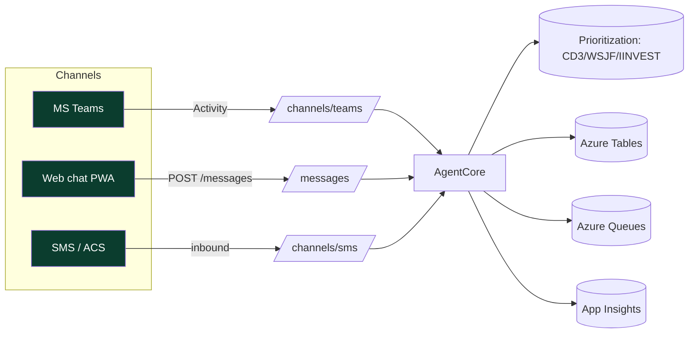

# Deming — Architecture (audit-proof design doc)

## Context

Deming is the agent-of-agents coach. Same app shape as the specialist agents (Functions API + SWA PWA
+ Tables/Queues) so the platform is uniform and the standards Deming enforces apply to itself.

## Components

| Component | Tech | Responsibility |
| --- | --- | --- |
| `api` | Azure Functions Flex Consumption, Node 20 TS | Brain + channel webhooks |
| `web` | Vite + React PWA on Static Web Apps | Web chat / coach dashboard |
| Storage | Azure Tables + Queues | Conversations, backlog, events |
| Monitoring | App Insights + Log Analytics | Telemetry, build/quality KPIs |

## Quality attributes (contract §7)

- **Testability:** core logic isolated in `src/core`; coverage threshold 80% enforced in `vitest.config.ts`.
- **Performance:** build budget <180s; PWA caches API responses (NetworkFirst) for offline mode.
- **Operability:** ring exposed as `AGENT_RING`; one Bicep stack per ring.

## Security

- HTTPS only; managed identity for storage (no keys); channel webhooks use `function` auth level.
- SWA global headers set (`nosniff`, `DENY`, `no-referrer`).

## Ring topology (contract §3)

`canary → private → public → ga`, each its own resource group (`rg-deming-<ring>`), GA using
RA-GRS storage and a geo-redundant region pair.
